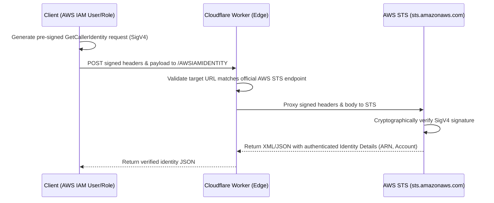

When building integrations between non-AWS environments (like Cloudflare Workers, Kubernetes, or HashiCorp Vault) and AWS resources, a common challenge arises: **How can a third-party server securely verify the AWS IAM identity (User or Role ARN) of an incoming requester?**

If the client signed the request directly to your server, you would need their AWS Secret Access Key to verify the signature. Since sharing secret keys is a major security vulnerability, we must use a cryptographic pattern called the **STS GetCallerIdentity Proxy**.

---

## 🏗️ The Architecture (STS Delegation)

Instead of verifying the cryptographic signature ourselves, we delegate the validation to AWS's own Security Token Service (STS). 



---

## 🛠️ Step 1: The Client-Side (AWS Signing)

To prove their identity, the client uses their AWS credentials to sign a standard `GetCallerIdentity` request targeted at `https://sts.amazonaws.com/`. 

Instead of executing this request, the client extracts the signed headers (including `Authorization` and `X-Amz-Date`) and packages them as JSON. 

Here is how to do it in an AWS Lambda function with **zero external dependencies**:

```python
import os
import json
import urllib3
import boto3
from botocore.auth import SigV4Auth
from botocore.awsrequest import AWSRequest
from urllib.parse import urlparse

def lambda_handler(event, context):
    website_url = event.get("website_url") or os.environ.get("WEBSITE_URL")
    
    # 1. Fetch temporary execution credentials
    session = boto3.Session()
    credentials = session.get_credentials().get_frozen_credentials()
    
    # 2. Extract website hostname to bind into the signature
    parsed_url = urlparse(website_url)
    hostname = parsed_url.hostname or "sts.amazonaws.com"
    
    # 3. Construct the STS request with target Server ID
    sts_url = "https://sts.amazonaws.com/"
    headers = {
        "Host": "sts.amazonaws.com",
        "Content-Type": "application/x-www-form-urlencoded",
        "X-Auth-Server-Id": hostname  # Cryptographically binds the recipient website
    }
    body_data = "Action=GetCallerIdentity&Version=2011-06-15"
    
    # 4. Cryptographically sign the request (SigV4)
    # The X-Auth-Server-Id header will be added to the signature (SignedHeaders)
    aws_request = AWSRequest(method="POST", url=sts_url, headers=headers, data=body_data)
    SigV4Auth(credentials, "sts", "us-east-1").add_auth(aws_request)
    
    # 5. POST the signed request headers to Cloudflare
    payload = {
        "url": sts_url,
        "method": "POST",
        "headers": dict(aws_request.headers.items()),
        "body": body_data
    }
    
    http = urllib3.PoolManager()
    response = http.request("POST", website_url, body=json.dumps(payload), headers={"Content-Type": "application/json"})
    return json.loads(response.data.decode("utf-8"))
```

---

## ⚡ Step 2: The Edge-Side (Cloudflare Workers)

The Cloudflare Worker receives the signed headers, forwards them directly to AWS STS using `fetch`, parses the response, and extracts the caller's true ARN:

```typescript
export const onRequest = async (context) => {
  const { request } = context;
  const payload = await request.json();
  const headersInput = payload.headers || {};

  // 1. Get expected Server ID (the worker's own hostname)
  const expectedHostname = new URL(request.url).hostname;
  
  // Retrieve X-Auth-Server-Id from client payload headers
  const getHeader = (headers: any, name: string) => {
    const lower = name.toLowerCase();
    const entry = Object.entries(headers).find(([k]) => k.toLowerCase() === lower);
    return entry ? (Array.isArray(entry[1]) ? entry[1][0] : entry[1]) : "";
  };
  
  // 2. Verify Server ID matches and was signed
  const serverId = getHeader(headersInput, "X-Auth-Server-Id");
  if (serverId !== expectedHostname) {
    return new Response("X-Auth-Server-Id mismatch or missing", { status: 400 });
  }
  
  const authorization = getHeader(headersInput, "Authorization") as string;
  const signedHeaders = authorization.match(/SignedHeaders=([^,]+)/i)?.[1]?.split(";") || [];
  if (!signedHeaders.includes("x-auth-server-id")) {
    return new Response("The X-Auth-Server-Id header was not signed by the client", { status: 400 });
  }

  // 3. SSRF Protection: Only allow official AWS STS hosts
  const isSts = /^sts\.(?:[a-z0-9-]+\.)*amazonaws\.com(?:\.cn)?$/.test(new URL(payload.url).hostname);
  if (!isSts) return new Response("Invalid URL", { status: 400 });

  // 4. Construct headers and forward the signed request to AWS STS
  const headersToSend = new Headers();
  for (const [key, value] of Object.entries(headersInput)) {
    const lowerKey = key.toLowerCase();
    if (
      lowerKey.startsWith("x-amz-") ||
      lowerKey === "authorization" ||
      lowerKey === "content-type" ||
      lowerKey === "accept" ||
      lowerKey === "x-auth-server-id"
    ) {
      headersToSend.set(key, Array.isArray(value) ? value[0] : (value as string));
    }
  }

  const stsResponse = await fetch(payload.url, {
    method: payload.method,
    headers: headersToSend,
    body: payload.body,
  });

  const responseText = await stsResponse.text();
  
  // 5. Parse response to extract authenticated details
  const arn = responseText.match(/<Arn>([^<]+)<\/Arn>/)?.[1];
  const account = responseText.match(/<Account>([^<]+)<\/Account>/)?.[1];
  
  return new Response(JSON.stringify({ Arn: arn, Account: account }), {
    headers: { "Content-Type": "application/json" }
  });
};
```

---

## 🔒 Security Best Practices

### 1. Server-Side Request Forgery (SSRF) Prevention
Because the Cloudflare Worker receives a URL from the client and executes an outgoing HTTP request, you must validate the hostname. Using a strict regex (such as `/^sts\.(?:[a-z0-9-]+\.)*amazonaws\.com$/`) ensures the worker cannot be abused as an arbitrary proxy or scanner.

### 2. Replay Attack Prevention (Server ID Header)
A malicious actor could intercept the signed request headers and replay them to gain unauthorized access. To mitigate this:
*   Use a custom header like `X-Amz-Security-Token` (standard for session credentials, expires after a short period).
*   Enforce a custom authentication header in the signature, such as `X-Auth-Server-Id` containing the domain of your website. Because this header is included in the cryptographic signature, AWS STS verification will fail if the signature is replayed against a different endpoint.

### 3. Service Restriction (STS Only)
The signature **must** be generated specifically for the `sts` service (using the credential scope `<date>/<region>/sts/aws4_request`). If the client attempts to sign the request for any other AWS service (such as S3, EC2, or DynamoDB), the verification will fail. This is because the signature is cryptographically tied to the service name. If the Worker forwards a request signed for `s3` to `sts.amazonaws.com`, AWS STS will reject it with a `SignatureDoesNotMatch` error.

---

## 🆚 Comparison: Edge Verification vs. AWS API Gateway

A common question is: **How does this differ from AWS API Gateway's native IAM Authorization?**

### AWS API Gateway (First-Party Verification)
API Gateway is part of the AWS ecosystem. When it receives a request signed with IAM credentials (using the service scope `execute-api` and the API's endpoint as the `Host`):
1. **Natively Verifies**: API Gateway has direct, secure backend access to AWS's internal IAM database. It looks up the `Access Key ID` and retrieves the corresponding `Secret Access Key` internally.
2. **Local Recalculation**: It decrypts and verifies the signature itself without having to proxy requests to an external service like STS.
3. **No Replay Threat**: Because the signature is natively bound to the API Gateway's specific endpoint host, there is no threat of replay across different systems, meaning custom headers like `X-Auth-Server-Id` are unnecessary.

### Edge Worker (Third-Party Verification)
A Cloudflare Worker runs entirely outside of AWS. Because Cloudflare does not (and should not) have access to AWS's internal database of secret keys:
1. **Delegates Trust**: The Worker must act as a proxy, forwarding the client-signed request to AWS STS to do the cryptographic verification.
2. **Requires Server ID Binding**: Because the request is addressed to AWS STS, the `Host` header must say `sts.amazonaws.com`. To prevent this STS signature from being stolen and replayed across different sites, the custom `X-Auth-Server-Id` header is mandatory to lock the signature to your specific domain.


